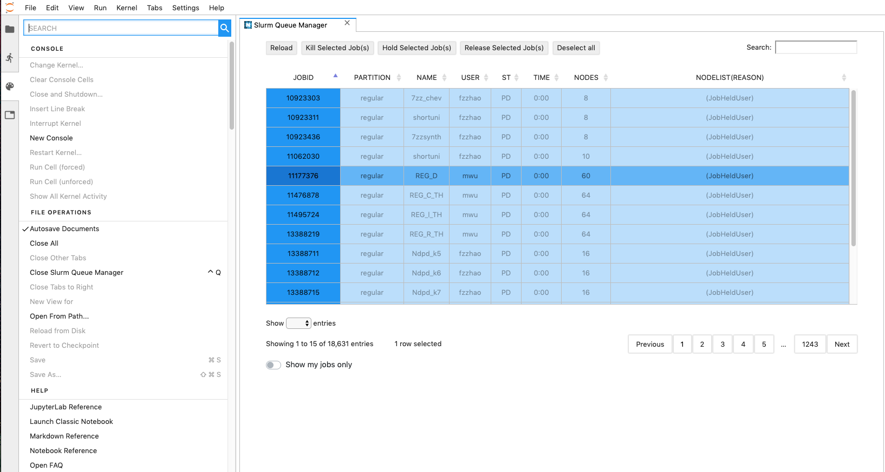

# Slurm JupyterLab Extension

A JupyterLab extension to interface with the Slurm Workload Manager, 
providing simple and intuitive controls for viewing and managing queued jobs.



## Prerequisites

* JupyterLab >= 0.35
* Node.js 5+
* Slurm


## Installation

This extension includes both a client-side JupyterLab extension and a server-side
Jupyter notebook server extension. Install these using the command line with

```bash
pip install jupyterlab_slurm
jupyter labextension install jupyterlab-slurm
```

After launching JupyterLab, the extension can be found in the command palette under
the name ```Slurm Queue Manager```, and is listed under the ```HPC TOOLS``` section
of the palette and the launcher.


### Development install

As described in the [JupyterLab documentation](https://jupyterlab.readthedocs.io/en/stable/developer/extension_dev.html#extension-authoring) for a development install of the labextension you can run the following in this directory:

```bash
jlpm install   # Install npm package dependencies
jlpm run build  # Compile the TypeScript sources to Javascript
jupyter labextension install  # Install the current directory as an extension
```

To rebuild the extension:

```bash
jlpm run build
```

If you run JupyterLab in watch mode (`jupyter lab --watch`) it will automatically pick
up changes to the built extension and rebundle itself.

To run an editable install of the server extension, run

```bash
pip install -e .
jupyter serverextension enable --sys-prefix jupyterlab_slurm
```