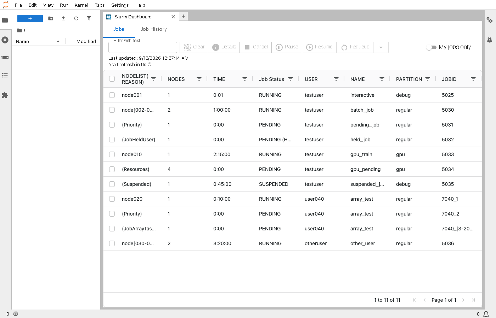

# Slurm JupyterLab Extension

A JupyterLab extension that interfaces with the Slurm Workload Manager,
providing simple and intuitive controls for viewing and managing jobs on the queue.



## Prerequisites

- JupyterLab >= 4.0.0
- Slurm

## Architecture

This extension consists of two main parts:

- **Backend (Python)**: A Jupyter Server extension that provides a REST API to interface with Slurm commands (`squeue`, `sbatch`, `scancel`, `scontrol`, `sacct`).
  - Handlers are located in `jupyterlab_slurm/handlers.py`.
  - It uses a base class `SlurmCommandHandler` to execute shell commands and handle errors.
  - Job details use a specialized `JobDetailsHandler` that normalizes data from both `scontrol` and `sacct`.
- **Frontend (TypeScript/React)**: A JupyterLab extension that provides the UI.
  - Built with React, MUI (Material UI), and `ag-grid-react` for high-performance table rendering.
  - Main components: `SlurmWidget` (top-level), `SqueueDataTable` (live queue), `SlurmJobHistory` (completed jobs), and `JobDetailsPanel` (detailed inspection).
  - State management handles polling, selection snapshots, and navigation between job details.

## Installation

This extension includes both a client-side JupyterLab extension and a server-side
Jupyter notebook server extension. Install these using the command line with

```bash
pip install jupyterlab_slurm
```

If you are running Notebook 5.2 or earlier, enable the server extension by running

```bash
jupyter serverextension enable --py --sys-prefix jupyterlab_slurm
```

After launching JupyterLab, the extension can be found in the command palette under
the name `Slurm Dashboard`, and is listed under the `HPC TOOLS` section
of the palette and the launcher.

### Development install

As described in the [JupyterLab documentation](https://jupyterlab.readthedocs.io/en/stable/extension/extension_dev.html#extension-authoring) for a development install of the labextension you can run the following in this directory:

```bash
# install the extension in editable mode
pip install -e .
# point the labextension dev install at the current dir
jupyter labextension develop --overwrite .
# rerun this if there are updates:
jlpm run build
```

### Testing against a local Slurm cluster

For realistic, end-to-end testing against a real Slurm controller, this repo
builds on top of the upstream
[`giovtorres/slurm-docker-cluster`](https://github.com/giovtorres/slurm-docker-cluster)
project, which provides a Docker Compose stack running a current,
version-selectable Slurm (multi-arch, with pre-built images). It is a plain
git checkout (not a submodule) into `docker/slurm-cluster`, which is
git-ignored in this repo. `docker/cluster.sh up` automates checking it out
and bringing it up (see `docker/README.md` for the full set of automated
commands and the manual steps they replace), then install this extension
(`pip install -e .`) into a
JupyterLab 4 environment that shares the cluster's munge key and
`/etc/slurm` so the Slurm client commands can connect. `docker/jupyterhub/`
builds on top of that cluster to also exercise per-user JupyterHub spawning
against it.
