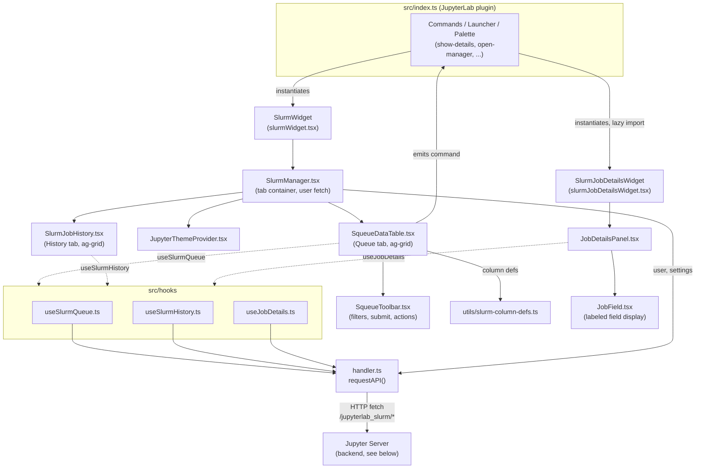
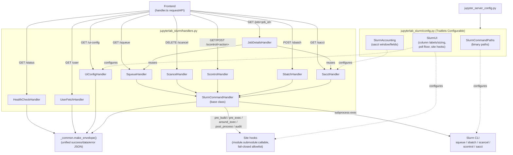

(architecture)=

# Architecture

This page gives an overview of how `jupyterlab-slurm` is put together, for
developers who want to extend or debug the extension. It complements
{ref}`api` (REST endpoint reference) and {ref}`development` (build/install
instructions) with two diagrams: the frontend (UI) component tree, and the
backend (Jupyter Server) request-handling pipeline.

## UI components

The frontend is a standard JupyterLab plugin (`src/index.ts`) that
registers commands/launcher entries and lazily instantiates two top-level
widgets: the main `SlurmWidget` (queue + history) and a separate
`SlurmJobDetailsWidget` (opened per-job via the `COMMAND_ID_SHOW_DETAILS`
command). Data fetching is centralized in `handler.ts` (`requestAPI`) and
wrapped by small hooks (`useSlurmQueue`, `useSlurmHistory`,
`useJobDetails`) that the presentational components consume.

Key points:

- `handler.ts` is the single choke point for all HTTP calls to the server
  extension, including unified error handling (`SlurmApiError`).
- The three `hooks/*` modules own polling/loading/error state for their
  respective data sources, keeping the presentational components
  (`SqueueDataTable`, `SlurmJobHistory`, `JobDetailsPanel`) focused on
  rendering.
- `SqueueDataTable` and `JobDetailsPanel` communicate via JupyterLab
  commands (e.g. `COMMAND_ID_SHOW_DETAILS`) rather than direct references,
  since they can live in separate widgets/tabs.

## Backend components

The server extension (`jupyterlab_slurm/`) registers a set of Tornado
`APIHandler`s under `/jupyterlab_slurm/*`. Each Slurm-command handler
extends the shared `SlurmCommandHandler` base class, builds a command line,
runs it (optionally through site hooks), and returns a unified JSON
envelope built by `_common.make_envelope`. Deployment-level behavior is
supplied by Traitlets `Configurable`s, loaded from the Jupyter Server
config file.

Key points:

- All handlers respond with the same envelope shape
  (`{success, data, errorMessage, exitCode, responseMessage}`), which is
  what `handler.ts`/`SlurmApiError` on the frontend expect.
- `JobDetailsHandler` composes data from `squeue`/`sacct` rather than
  calling a dedicated Slurm command, to build a consolidated per-job view.
- Site hooks are opt-in and fail-closed: they only run if explicitly
  listed in `SlurmUI.site_hook_allowlist`, see {ref}`configuration` for
  details.
