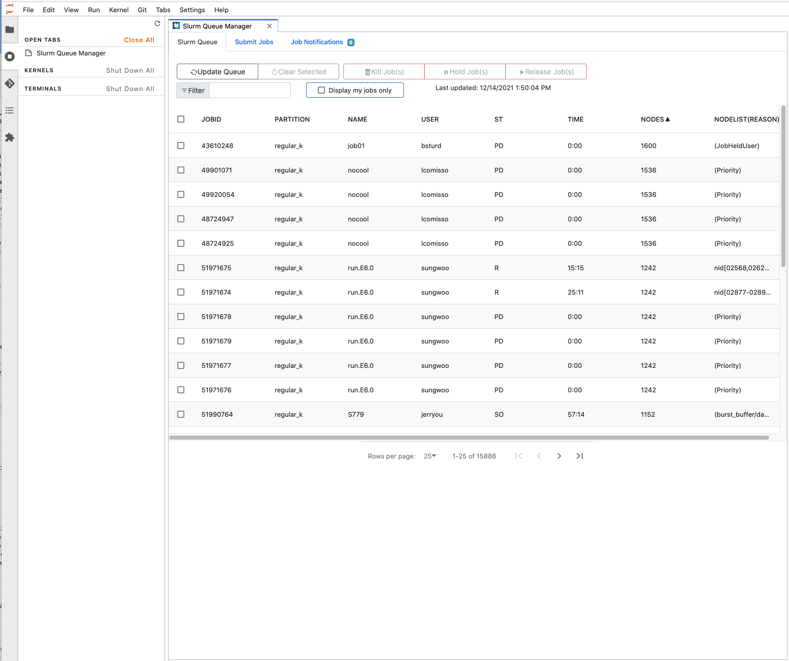

.. jupyterlab-slurm documentation master file, created by
   sphinx-quickstart on Sun Feb 17 22:59:14 2019.
   You can adapt this file completely to your liking, but it should at least
   contain the root `toctree` directive.

Introducing the Slurm Extension for JupyterLab 
==============================================

``jupyterlab-slurm`` is an extension for JupyterLab that interfaces with the Slurm Workload Manager, 
providing simple and intuitive controls for viewing and managing jobs on the queue, as well as submitting new jobs to the queue.

.. toctree::
   :maxdepth: 2
   :caption: Contents:

   contents/overview
   contents/installation
   contents/usage
   contents/configuration
   contents/development

Relevant Links
^^^^^^^^^^^^^^^^^
* `GitHub Repository <https://github.com/NERSC/jupyterlab-slurm>`_
* `NPM Listing for Lab Extension <https://www.npmjs.com/package/jupyterlab-slurm>`_
* `PyPi Listing for Server Extension <https://pypi.org/project/jupyterlab-slurm/>`_
* `JupyterLab Documentation <https://jupyterlab.readthedocs.io/en/stable/>`_
* `Slurm Documentation <https://slurm.schedmd.com/>`_ 
* `NERSC Homepage <https://www.nersc.gov/>`_